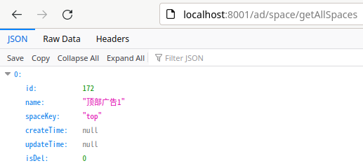
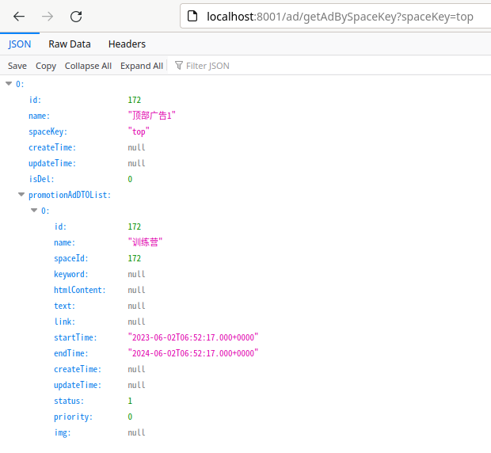

# Getting Started

### Reference Documentation

For further reference, please consider the following sections:

* [Official Apache Maven documentation](https://maven.apache.org/guides/index.html)
* [Spring Boot Maven Plugin Reference Guide](https://docs.spring.io/spring-boot/docs/2.7.11/maven-plugin/reference/html/)
* [Create an OCI image](https://docs.spring.io/spring-boot/docs/2.7.11/maven-plugin/reference/html/#build-image)

### startup

run edu-ad-boot-impl module

then input `http://localhost:8001/ad/space/getAllSpaces` in web browser, will get the page

### GET Ad by space key

input `http://localhost:8001/ad/getAdBySpaceKey?spaceKey=top` in web browser, will get the page

