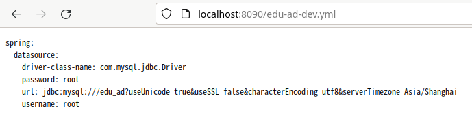

# Read Me First

The following was discovered as part of building this project:

* The JVM level was changed from '1.8' to '17', review
  the [JDK Version Range](https://github.com/spring-projects/spring-framework/wiki/Spring-Framework-Versions#jdk-version-range)
  on the wiki for more details.

# Getting Started

### Reference Documentation

For further reference, please consider the following sections:

* [Official Apache Maven documentation](https://maven.apache.org/guides/index.html)
* [Spring Boot Maven Plugin Reference Guide](https://docs.spring.io/spring-boot/docs/3.0.6/maven-plugin/reference/html/)
* [Create an OCI image](https://docs.spring.io/spring-boot/docs/3.0.6/maven-plugin/reference/html/#build-image)

### startup

startup edu-config-boot module

then input `http://localhost:8090/edu-ad-dev.yml` in web browser, will get the page

