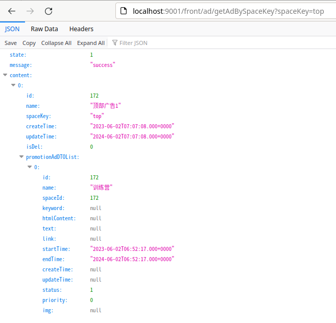

# Getting Started

### startup

run edu-gateway-boot module

then input `http://localhost:9001/boss/ad/space/getAllSpaces` in web browser, will get the page

### Get ad info by space

input `http://localhost:9001/front/ad/getAdBySpaceKey?spaceKey=top` in web browser, will get the page

